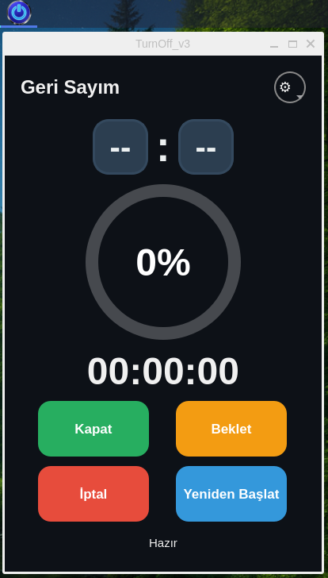
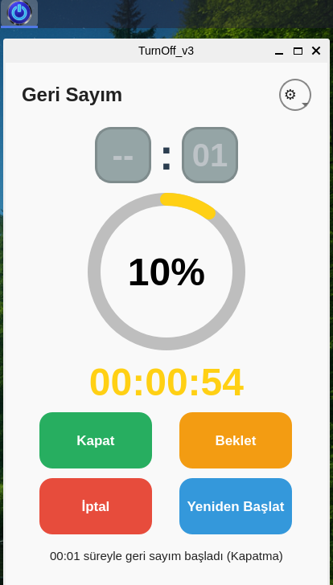
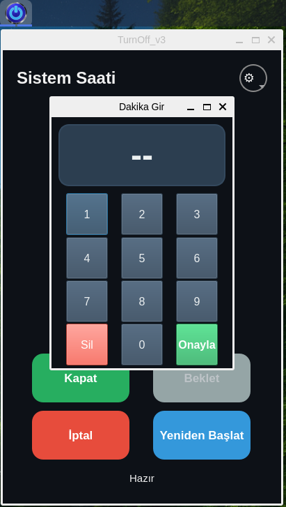
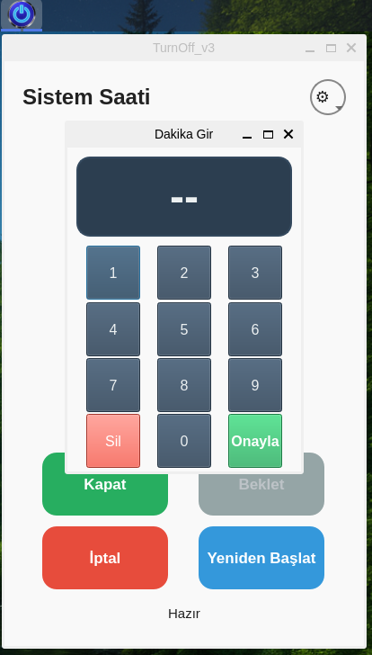
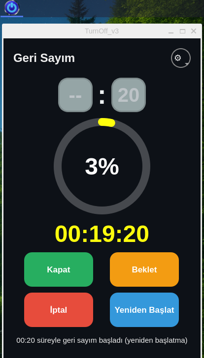

## Ekran Görüntüleri

[resim4](4.png)!

# TurnOff_v3

Linux için modern bir süre ayarlı kapatma / yeniden başlatma aracı . 

## Kurulum

* Uygulama çalışması için bağımlılık gerektirir . (python3-pyqt5)
 
* sudo apt install python3-pyqt5 -y     Komutu termianele yapıştırıp kurumlum yapabilirsiniz.

* turnoff-v3.deb paketini çift tıklayıp kurulum yapabilirsiniz  .   

Terminalden Kurulum . 

* turnoff-v3.deb   paketini Masaüstü ne koyun 

*  cd ~/Masaüstü

*  sudo dpkg -i turnoff-v3.deb

TurnOff_v3
 
Özellikler

İki giriş modu:
Sistem Saati: Belirlediğiniz bir saate gelince işlem yapar (örneğin 22:30).
Geri Sayım: Belirlediğiniz süre sonunda işlem yapar (örneğin 1 saat 30 dakika sonra).

İşlem seçenekleri:
Bilgisayarı kapatır.
Bilgisayarı yeniden başlatır.

Kullanım kolaylığı:
Saat ve dakika girişi için özel sayısal tuş takımı (rakamlar, silme, onaylama).
Klavye desteği (0-9 rakamlar, Backspace, Enter, Esc).

Geri sayım ekranı:
Büyük dijital saat gösterimi (kalan süre: ss:dd:ss).
Renk geçişli dairesel ilerleme çemberi (yüzde dolum, sarı → turuncu → yeşil → kırmızı).
Kalan süreye göre otomatik renk değişimi.

Kontroller:
Başlat (Kapat veya Yeniden Başlat).
Beklet / Devam Et (sadece Geri Sayım modunda).
İptal (geri sayımı durdurur ve ayarları sıfırlar).

Tema desteği:
Karanlık (Dark) tema.
Açık (Light) tema.
Seçilen tema uygulama kapatılıp açılsa bile hatırlanır.

Diğer özellikler:
Seçilen giriş modu (Sistem Saati / Geri Sayım) kalıcı olarak hatırlanır.
Aynı anda birden fazla uygulama açılamaz (tek instance).
Geri sayım aktifken programı kapatmaya izin vermez (güvenlik).
Geçersiz girişlerde uyarı verir.
Modern, sade ve okunaklı arayüz.
     
