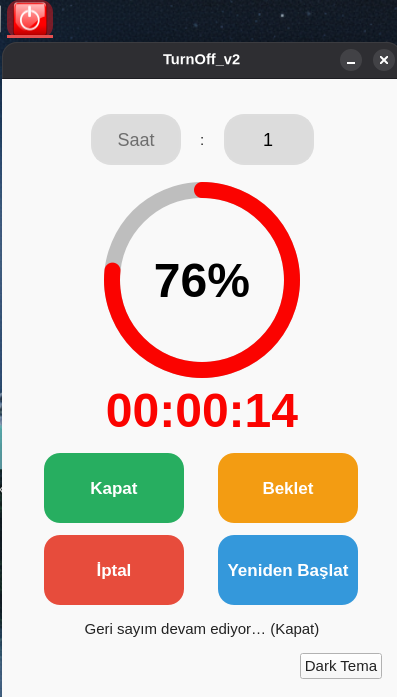
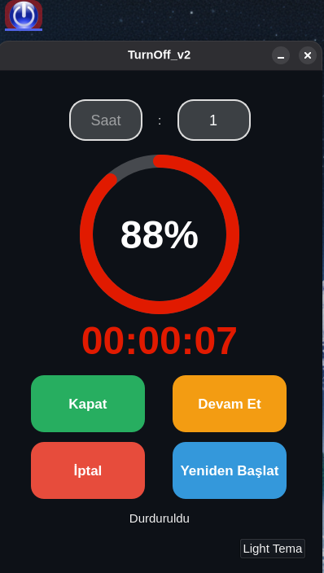

## Ekran Görüntüleri

# TurnOff_v2

Linux için modern bir süre ayarlı kapatma / yeniden başlatma aracı . 

## Kurulum

* Uygulama çalışması için bağımlılık gerektirir . (python3-pyqt5)
 
* sudo apt install python3-pyqt5 -y     Komutu termianele yapıştırıp kurumlum yapabilirsiniz.

* turnoff-v2.deb paketini çift tıklayıp kurulum yapabilirsiniz  .   

Terminalden Kurulum . 

* turnoff-v2.deb   paketini Masaüstü ne koyun 

*  cd ~/Masaüstü

*  sudo dpkg -i turnoff-v2.deb 
     
